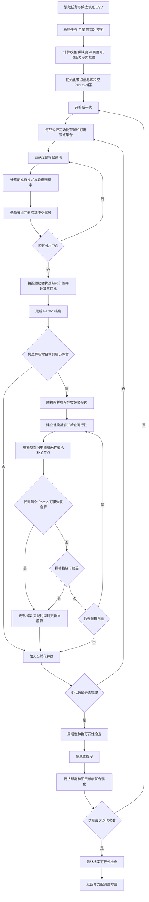

# CG-MOACO 算法执行流程与公式

> 本文描述项目当前实现的非强化学习版 CG-MOACO，即 Conflict-Graph-Guided Multi-Objective Ant Colony Optimization。内容与 `modules/cg_moaco.py`、`modules/conflict_graph.py`、`modules/local_search.py` 和 `modules/problem_model.py` 对齐，不包含 DDQN、状态特征、动作选择、奖励函数、经验回放或 Advantage 校正。

## 1. 算法定位

CG-MOACO 面向多星对地观测任务调度问题。算法先将每个“任务-卫星-时间窗口”组合编码为候选节点，再用冲突图统一表示任务互斥、时间重叠和姿态转换时间不足等约束。在此基础上，蚂蚁依据“信息素 + 冲突图启发式”构造互不冲突的调度方案，并通过 Pareto 档案、图感知信息素更新以及替换-插入补全复合局部搜索优化三个目标：

1. 最大化任务总收益；
2. 最小化姿态机动代价；
3. 最小化卫星负载不均衡度。

代码内部将三个目标统一写成最小化形式。

## 2. 符号与候选节点编码

| 符号 | 含义 |
|---|---|
| $\mathcal{T}$ | 任务集合 |
| $\mathcal{K}$ | 卫星集合 |
| $V$ | 候选节点集合 |
| $v_i=(j,k,w)$ | 任务 $j$ 在卫星 $k$ 的第 $w$ 个可见窗口上的候选执行节点 |
| $s_i,e_i$ | 候选节点 $v_i$ 的窗口起止时间 |
| $d_j$ | 任务 $j$ 的观测持续时间 |
| $p_j$ | 任务 $j$ 的收益 |
| $N(i)$ | 冲突图中节点 $v_i$ 的邻接节点集合 |
| $S\subseteq V$ | 一个调度方案，即被选中的候选节点集合 |
| $\tau_i$ | 候选节点 $v_i$ 的信息素浓度 |
| $\eta_i$ | 候选节点 $v_i$ 的动态启发式值 |
| $\mathcal{A}$ | 外部 Pareto 档案 |

当前编码采用固定窗口起点执行：

$$
t_i^{\mathrm{start}}=s_i,
\qquad
t_i^{\mathrm{end}}=s_i+d_j.
$$

因此，算法不是在窗口内部继续搜索实际开始时刻，而是为每个候选节点固定一个观测区间。预处理阶段会删除窗口长度小于任务持续时间的候选节点，即要求

$$
s_i+d_j\le e_i.
$$

## 3. 多目标优化模型

令 $x_i\in\{0,1\}$ 表示是否选择候选节点 $v_i$。算法评价向量为

$$
\mathbf{F}(S)=\left(f_1(S),f_2(S),f_3(S)\right),
$$

且三个分量均按最小化处理。

### 3.1 总收益目标

原问题要求最大化已调度任务的总收益。由于算法框架统一最小化，代码使用负收益：

$$
f_1(S)=-P(S)
=-\sum_{j\in\mathcal{T}}p_j y_j,
$$

其中，当任务 $j$ 至少有一个候选节点被选中时 $y_j=1$，否则 $y_j=0$。因此，$f_1$ 越小表示总收益越高。可行解中每个任务最多执行一次。

### 3.2 姿态机动代价

对每颗卫星，将已选节点按开始时间排序。设卫星 $k$ 上的观测序列为

$$
\pi_k=\left(v_{k,1},v_{k,2},\ldots,v_{k,n_k}\right),
$$

则姿态机动代价为相邻观测之间的转换时间之和：

$$
f_2(S)=
\sum_{k\in\mathcal{K}}
\sum_{r=1}^{n_k-1}
T^{\mathrm{tr}}\!\left(v_{k,r},v_{k,r+1}\right).
$$

当前实现使用前一观测结束时刻的滚转角和俯仰角，以及后一观测开始时刻的滚转角和俯仰角。偏航角不参与计算：

$$
\Delta(a,b)=
\left|\phi_a^{\mathrm{end}}-\phi_b^{\mathrm{start}}\right|
+
\left|\theta_a^{\mathrm{end}}-\theta_b^{\mathrm{start}}\right|.
$$

姿态转换时间采用分段函数：

$$
T^{\mathrm{tr}}(a,b)=
\begin{cases}
\dfrac{35}{3}, & \Delta\le 10,\\[4pt]
\dfrac{\Delta}{1.5}+5, & 10<\Delta<30,\\[4pt]
\dfrac{\Delta}{2}+10, & 30\le\Delta<60,\\[4pt]
\dfrac{\Delta}{2.5}+16, & 60\le\Delta<90,\\[4pt]
\dfrac{\Delta}{3}+22, & \Delta\ge 90.
\end{cases}
$$

其中，$\Delta$ 的单位为度，$T^{\mathrm{tr}}$ 的单位为秒。若候选节点缺少姿态角，代码退化为坐标距离近似：

$$
T^{\mathrm{tr}}(a,b)
=t_{\min}+c_m
\sqrt{(q_{a,1}-q_{b,1})^2+(q_{a,2}-q_{b,2})^2}.
$$

当前默认值为 $t_{\min}=5.0$、$c_m=0.2$。当 CSV 中存在姿态角且 `use_attitude_transition_time=True` 时，这两个参数不会参与主姿态转换公式，只用于缺少姿态角时的兼容计算。

### 3.3 卫星负载不均衡度

设 $L_k(S)$ 为卫星 $k$ 的负载，$K=|\mathcal{K}|$，平均负载为

$$
\bar L=\frac{1}{K}\sum_{k\in\mathcal{K}}L_k(S).
$$

负载不均衡度使用总体标准差：

$$
f_3(S)=
\sqrt{
\frac{1}{K}
\sum_{k\in\mathcal{K}}
\left(L_k(S)-\bar L\right)^2
}.
$$

当前 `main.py` 设置 `load_mode="task_count"`，因此 $L_k$ 为卫星 $k$ 执行的任务数。若改为 `duration`，则 $L_k$ 为总观测时长。问题模型、CG-MOACO 构造启发式和局部搜索均读取同一个 `load_mode`。

## 4. 约束与冲突图建模

### 4.1 一个任务最多执行一次

同一任务的不同卫星或不同时间窗口候选节点两两互斥：

$$
\sum_{i:\,\operatorname{task}(v_i)=j}x_i\le 1,
\qquad \forall j\in\mathcal{T}.
$$

### 4.2 可见窗口约束

候选节点的实际观测区间必须完全位于对应可见窗口内：

$$
[s_i,s_i+d_j]\subseteq[s_i,e_i].
$$

### 4.3 同一卫星时序与姿态转换约束

若同一卫星上的观测 $a$ 位于观测 $b$ 之前，则必须满足

$$
s_a+d_a+T^{\mathrm{tr}}(a,b)\le s_b.
$$

如果两个固定观测区间重叠，或者中间空隙不足以完成姿态转换，则这两个候选节点不能同时被选择。

### 4.4 三元冲突图

构造无向图

$$
G=(V,E),
$$

其中每个顶点是任务-卫星-窗口候选节点。若以下任一条件成立，则在 $v_i$ 与 $v_l$ 之间加入冲突边：

1. 两个节点属于同一任务；
2. 两个节点属于同一卫星，且固定观测区间重叠；
3. 两个节点属于同一卫星，且相邻观测间隔小于姿态转换时间。

于是，可行调度对应冲突图的独立集：

$$
S\text{ 可行}
\iff
\forall v_i,v_l\in S,\ (v_i,v_l)\notin E.
$$

等价地，任意已选节点均不能与当前解中的其他节点相邻：

$$
N(i)\cap S=\varnothing.
$$

## 5. 冲突图静态特征

CG-MOACO 为每个候选节点计算四类特征。

### 5.1 节点收益

$$
P_i=p_{\operatorname{task}(v_i)}.
$$

### 5.2 窗口稀缺度

设任务 $j$ 共有 $m_j$ 个候选节点，则

$$
R_i=\frac{1}{m_j},
\qquad j=\operatorname{task}(v_i).
$$

候选窗口越少，节点稀缺度越高。

### 5.3 冲突度

$$
C_i=|N(i)|.
$$

冲突度越大，选择该节点后被排除的其他候选节点通常越多。

### 5.4 姿态机动压力

对于节点 $v_i$，代码选取同一卫星上开始时间最接近的至多 30 个节点，并计算平均姿态转换时间：

$$
M_i=
\frac{1}{|\mathcal{Q}_i|}
\sum_{v_l\in\mathcal{Q}_i}
T^{\mathrm{tr}}(v_i,v_l),
$$

其中 $\mathcal{Q}_i$ 是该局部时间邻域。若不存在其他同星节点，则 $M_i=0$。

### 5.5 特征归一化

各特征使用最小-最大归一化：

$$
\widetilde z_i=
\frac{z_i-z_{\min}}{z_{\max}-z_{\min}}.
$$

若同一特征的所有节点取值相等，代码将其归一化值统一设为 1。

### 5.6 冲突图贡献度

静态冲突图贡献度定义为

$$
g_i=
\max\left(
\varepsilon,
\frac{
\widetilde P_i+\lambda_s\widetilde R_i
}{
1+\lambda_c\widetilde C_i+\lambda_m\widetilde M_i
}
\right),
$$

其中 $\varepsilon=10^{-9}$。$\lambda_s$、$\lambda_c$ 和 $\lambda_m$ 分别控制稀缺度、冲突度和姿态机动压力的影响。该贡献度同时用于候选池排序和图感知信息素增量。

## 6. 冲突图引导的蚁群构造

### 6.1 候选池预筛选

设当前仍可选择的节点集合为 $A_t$，候选池上限为 $K_c$，随机探索比例为 $r_c$。当 $|A_t|>K_c$ 时，代码构造

$$
K_{\mathrm{rand}}=\operatorname{round}(K_c r_c),
\qquad
K_{\mathrm{top}}=K_c-K_{\mathrm{rand}}.
$$

候选池由两部分组成：

1. 按静态贡献度 $g_i$ 降序选择 $K_{\mathrm{top}}$ 个节点；
2. 从剩余可用节点中随机抽取至多 $K_{\mathrm{rand}}$ 个节点。

这一步先压缩大规模候选集合，再保留少量随机探索。当前 `main.py` 使用 $K_c=300$、$r_c=0.15$。

### 6.2 动态负载感知启发式

在构造过程中，设卫星 $k$ 当前已分配的负载为 $L_k^{(t)}$。根据 `load_mode`，负载定义为

$$
L_k^{(t)}=
\begin{cases}
\displaystyle\sum_{v_i\in S_t}\mathbb{I}\!\left[\operatorname{sat}(v_i)=k\right],
& \texttt{task\_count},\\[8pt]
\displaystyle\sum_{v_i\in S_t}d_i\,\mathbb{I}\!\left[\operatorname{sat}(v_i)=k\right],
& \texttt{duration}.
\end{cases}
$$

其中，$d_i$ 是候选节点对应任务的实际观测时长。节点 $v_i$ 的归一化负载项为

$$
\widetilde L_i^{(t)}=
\frac{L_{\operatorname{sat}(v_i)}^{(t)}}
{\max\left(1,\max_{k\in\mathcal{K}}L_k^{(t)}\right)}.
$$

动态启发式函数为

$$
\eta_i^{(t)}=
\max\left(
\varepsilon,
\frac{
\widetilde P_i+\lambda_s\widetilde R_i
}{
1+\lambda_c\widetilde C_i
+\lambda_m\widetilde M_i
+\lambda_l\widetilde L_i^{(t)}
}
\right).
$$

该公式提高高收益、窗口稀缺节点的选择倾向，同时抑制高冲突、高机动压力和当前高负载卫星上的节点。

### 6.3 信息素-启发式概率选择

在当前候选池 $B_t\subseteq A_t$ 中，蚂蚁选择节点 $v_i$ 的概率为

$$
\Pr(v_i\mid B_t)=
\frac{
\tau_i^{\alpha}\left(\eta_i^{(t)}\right)^{\beta}
}{
\sum_{v_l\in B_t}
\tau_l^{\alpha}\left(\eta_l^{(t)}\right)^{\beta}
}.
$$

其中，$\alpha$ 控制信息素影响，$\beta$ 控制启发式影响。代码使用轮盘赌完成概率采样。

### 6.4 可用节点集合更新

若选中节点 $v_i$，则将其加入当前解，并同时删除自身及全部冲突邻居：

$$
S_{t+1}=S_t\cup\{v_i\},
$$

$$
A_{t+1}=A_t\setminus\left(\{v_i\}\cup N(i)\right).
$$

重复上述过程直至 $A_t=\varnothing$。因此，构造阶段直接生成冲突图独立集，并在通常情况下得到相对于当前候选图的极大独立集。

## 7. Archive 触发的 Pareto 局部搜索

蚂蚁完成构造并评价解 $S$ 后，先尝试将其加入外部档案。只有当 $S$ 不是重复方案，并且在非支配筛选与档案容量截断后仍被保留时，才执行一次局部搜索。由于完整构造解是极大独立集，局部搜索采用“随机替换释放空间、随机插入补全”的复合邻域，并以 first-improvement 方式接受候选，不再按收益或图贡献度排序。

### 7.1 随机冲突替换基解

对于外部候选节点 $v_i$，定义其与当前解的冲突集合

$$
D_i=N(i)\cap S.
$$

只保留满足 $1\le |D_i|\le C_{\max}$ 的节点，随机打乱后最多抽取 `replacement_attempts` 个。每个候选节点对应的替换基解为

$$
S_i^{\mathrm{rep}}=
\left(S\setminus D_i\right)\cup\{v_i\}.
$$

替换基解首先通过完整可行性检查，但暂不立即接受，而是优先用于生成插入补全邻域。

### 7.2 随机插入补全

替换删除冲突节点后，重新计算与替换基解兼容的外部节点：

$$
C_{\mathrm{fill}}(i)=
\left\{
u\notin S_i^{\mathrm{rep}}
\mid
N(u)\cap S_i^{\mathrm{rep}}=\varnothing
\right\}.
$$

由于原构造解是极大独立集，新释放的可行节点必然与至少一个被删除节点相邻。代码先从 $\bigcup_{d\in D_i}N(d)$ 生成补全候选，再按 $C_{\mathrm{fill}}(i)$ 的条件过滤，无需为每个替换基解扫描全部节点。随后将候选随机打乱，最多抽取 `local_search_candidate_limit` 个节点，并依次建立复合试探解

$$
S'_{i,u}=S_i^{\mathrm{rep}}\cup\{u\}.
$$

每个复合试探解都执行完整可行性检查和 Pareto 接受判断。找到第一个可接受解后立即停止全部局部搜索。若当前替换基解的所有插入补全方案均未被接受，则再将裸替换解 $S_i^{\mathrm{rep}}$ 作为回退候选；仍不接受时继续下一个随机替换节点。

### 7.3 Pareto 接受与 first-improvement

若 $\mathbf{F}(S')$ Pareto 支配 $\mathbf{F}(S)$，则用 $S'$ 更新当前解和外部档案，并立即结束局部搜索。支配关系定义为

$$
\mathbf{F}(S')\prec\mathbf{F}(S)
\iff
\left[
\forall m,\ f_m(S')\le f_m(S)
\right]
\land
\left[
\exists m,\ f_m(S')<f_m(S)
\right].
$$

若 $S'$ 与 $S$ 互不支配，且 $S'$ 在更新后确实被外部档案保留，则只更新档案，当前解仍保持为 $S$，并立即结束局部搜索。若 $S'$ 被当前解或档案中的任意方案支配，或者因档案容量截断而未被保留，则丢弃该试探解并继续随机尝试。

## 8. Pareto 外部档案

每只蚂蚁生成一个构造解后，立即将其与历史档案合并：

$$
\mathcal{U}=\mathcal{A}\cup\{S\}.
$$

删除重复调度方案和被支配解，得到非支配集合：

$$
\mathcal{A}'=\operatorname{ND}(\mathcal{U}).
$$

若档案规模超过上限，则使用拥挤距离维持目标空间多样性。对目标 $m$，内部解 $i$ 的拥挤距离增量为

$$
CD_i^{(m)}=
\frac{f_m^{i+1}-f_m^{i-1}}
{f_m^{\max}-f_m^{\min}},
$$

总拥挤距离为各目标增量之和：

$$
CD_i=\sum_m CD_i^{(m)}.
$$

各目标边界解的拥挤距离设为 $+\infty$。裁剪时反复删除有限拥挤距离最小的解，直至档案规模不超过 `archive_size`。

## 9. 冲突图感知的信息素更新

### 9.1 信息素挥发

每一代先对所有节点执行挥发：

$$
\tau_i\leftarrow
\max\left(\tau_{\min},(1-\rho)\tau_i\right).
$$

### 9.2 档案多样性权重

设档案解 $S_r$ 的拥挤距离为 $CD_r$，有限拥挤距离的最大值为 $CD_{\max}$。多样性权重定义为

$$
\omega_r=
\begin{cases}
1+\dfrac{CD_r}{CD_{\max}}, & CD_r<+\infty,\ CD_{\max}>0,\\[6pt]
2, & CD_r=+\infty,\\[4pt]
1, & \text{其他情况}.
\end{cases}
$$

### 9.3 图感知档案强化

对每个档案解 $S_r$ 中的节点 $v_i$，执行

$$
\tau_i\leftarrow
\min\left(
\tau_{\max},
\tau_i+q\,\omega_r g_i
\right).
$$

因此，一个节点只有同时出现在非支配解中、位于较稀疏的目标区域，并具有较高冲突图贡献度时，才会获得较强的信息素增量。若关闭 `use_graph_pheromone`，代码令 $g_i=1$，退化为仅由 Pareto 档案多样性引导的信息素更新。

## 10. 可行性检查策略

构造和局部搜索本身使用冲突邻接表保持可行性。为减少每只蚂蚁生成解后重复执行全量检查的开销，当前 `main.py` 使用以下策略：

1. `validate_each_solution=False`：每个解生成后不再执行一次完整 `is_feasible()`；
2. `validate_interval=30`：每隔 30 代检查当前种群的全部解；
3. `validate_final_archive=True`：算法返回前检查最终档案中的全部解。

对任意解 $S$，完整检查条件为

$$
\forall v_i\in S,\quad N(i)\cap S=\varnothing.
$$

周期检查或最终检查发现不可行解时，程序直接抛出 `RuntimeError`，不会静默输出不可行档案。

## 11. 完整执行流程



对应伪代码如下。

```text
输入：任务集合 T、候选节点 V、卫星集合 K、算法参数
输出：Pareto 外部档案 A

1. 构建冲突图 G=(V,E)
2. 计算每个节点的归一化图特征和静态贡献度 g
3. 初始化 tau_i=tau_0，A=空集
4. for iteration = 1, ..., I do
5.     P = 空集
6.     for ant = 1, ..., N_ant do
7.         S = 空集，Available = V，初始化卫星负载
8.         while Available 非空 do
9.             用 g 的高排名节点与随机节点组成候选池
10.            计算 eta_i 和 tau_i^alpha * eta_i^beta
11.            轮盘赌选择节点 v_i
12.            S = S 并 {v_i}
13.            Available 删除 {v_i} 并 N(i)
14.        end while
15.        按配置执行构造解可行性检查，计算 sol=F(S)
16.        (A, entered) = ArchiveUpdate(A, sol)
17.        if entered 且启用局部搜索 then
18.            随机打乱 C_rep，最多检查 K_rep 个替换节点 v
19.            对每个 v 构造 S_rep = S - D_v + {v}
20.            在替换释放空间中随机抽取最多 K_ins 个补全节点 u
21.            依次检查复合解 S' = S_rep + {u}
22.            若首个 Pareto 可接受复合解被 A 保留，则更新 A 并结束局部搜索
23.            若所有补全解均不接受，则检查裸替换解 S_rep
24.            裸替换仍不接受时继续下一个 v
25.            若邻域解支配 sol，则令 sol=邻域解；互不支配时 sol 保持不变
26.        end if
27.        将 sol 加入 P
28.    end for
29.    按 validate_interval 周期检查 P
30.    tau_i = max(tau_min, (1-rho)tau_i)
31.    用 A 的拥挤距离权重和 g_i 强化信息素
32. end for
33. 检查最终档案 A 的可行性
34. return A
```

## 12. 当前 `main.py` 实际实验参数

以下参数由 `main.py` 合并到 `CGMOACO`，优先级高于 `modules/cg_moaco.py` 中的默认值。

| 类别 | 参数 | 当前值 | 含义 |
|---|---:|---:|---|
| 实验预算 | `RUN_COUNT` | 10 | 独立运行轮数 |
| 实验预算 | `ITERATION_COUNT` | 300 | 每轮迭代代数 |
| 种群 | `POP_SIZE` / `num_ants` | 50 | 每代蚂蚁数量 |
| 档案 | `ARCHIVE_SIZE` | 100 | Pareto 档案上限 |
| 构造 | `alpha` | 1.0 | 信息素指数 |
| 构造 | `beta` | 2.0 | 启发式指数 |
| 信息素 | `rho` | 0.1 | 挥发率 |
| 信息素 | `q` | 0.2 | 档案强化系数 |
| 信息素 | `tau0` | 1.0 | 初始信息素 |
| 信息素 | `tau_min` | $10^{-6}$ | 信息素下界 |
| 信息素 | `tau_max` | 50.0 | 信息素上界 |
| 图启发式 | `lambda_scarcity` | 1.0 | 稀缺度权重 |
| 图启发式 | `lambda_conflict` | 1.0 | 冲突度惩罚权重 |
| 图启发式 | `lambda_maneuver` | 1.1 | 机动压力惩罚权重 |
| 图启发式 | `lambda_load` | 1.0 | 动态负载惩罚权重 |
| 问题模型 | `load_mode` | `task_count` | 负载使用任务数；可改为 `duration` 使用累计观测时间 |
| 候选池 | `candidate_pool_size` | 300 | 单步概率选择的候选池上限 |
| 候选池 | `candidate_random_ratio` | 0.15 | 候选池随机探索比例 |
| 局部搜索 | `local_search_candidate_limit` | 100 | 每个替换基解的插入补全采样上限 |
| 局部搜索 | `replacement_attempts` | 30 | 随机替换基解采样上限 |
| 局部搜索 | `max_replace_conflicts` | 3 | 单次替换最多删除的冲突节点数 |
| 可行性 | `validate_each_solution` | False | 是否逐解执行全量检查 |
| 可行性 | `validate_interval` | 30 | 种群周期检查间隔 |
| 可行性 | `validate_final_archive` | True | 是否检查最终档案 |
| 随机性 | `seed` | `2026 + run_idx` | 每轮独立随机种子 |

## 13. 与 RL-CG-MOACO 的边界

本文中的 CG-MOACO 不包含下列机制：

1. 不构造 RL 状态向量；
2. 不使用 DDQN 选择节点或控制搜索动作；
3. 不计算即时奖励、阻塞惩罚、最终奖励或 Advantage；
4. 不使用经验回放、目标网络和梯度训练；
5. 节点选择完全由候选池、信息素、动态图启发式和轮盘赌决定。

因此，非 RL 的 CG-MOACO 可以概括为：

$$
\boxed{
\text{冲突图建模}
+\text{图启发式蚁群构造}
+\text{Pareto 图感知信息素}
+\text{替换-插入补全复合局部搜索}
}
$$

## 14. 代码对应关系

| 算法组成 | 当前实现文件 |
|---|---|
| CG-MOACO 主循环、构造概率、信息素更新 | `modules/cg_moaco.py` |
| 冲突图、冲突边、图特征和贡献度 | `modules/conflict_graph.py` |
| 快速插入、冲突替换和接受准则 | `modules/local_search.py` |
| 三目标函数、姿态转换时间和可行性检查 | `modules/problem_model.py` |
| Pareto 支配、拥挤距离和档案裁剪 | `modules/utils.py` |
| 实验开关、参数覆盖和结果保存 | `main.py` |

## 15. 实现边界与复现实验注意事项

1. 当前调度开始时间固定为可见窗口起点，不在窗口内部连续优化开始时刻。
2. `candidate_nodes.csv` 必须包含与任务持续时间匹配的有效窗口；预处理和主程序都会拒绝窗口长度不足的节点。
3. 姿态转换优先使用前一观测结束姿态与后一观测开始姿态，只有缺少姿态数据时才使用坐标距离近似。
4. 所有 Pareto 比较均基于内部最小化向量 $(-\text{profit},\text{maneuver},\text{load})$。
5. 多算法对比时，应保持任务数据、问题模型参数、迭代预算、种群规模和独立运行次数一致。
